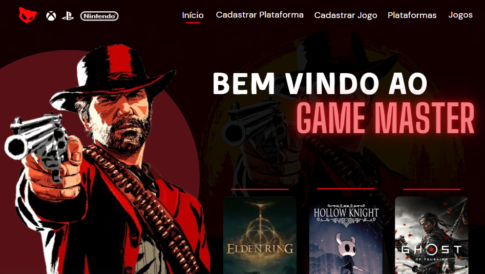

# Projeto-Game_Master-2024
Um dos primeiros projetos desenvolvidos durante o curso com a utilização do banco de dados, cliente e fornecedor

# Objetivo
Após os ensinamentos e aprendizados sobre banco de dados, utilizando SQL/DataBase, o professor propôs como atividade a elaboração de um sistema web (site) para um cliente. O sistema deve permitir o cadastro de plataformas e jogos. 

Na parte de cadastro de plataformas, o sistema deve incluir campos para o nome da plataforma, o fabricante e, por fim, gerar automaticamente um código único para cada plataforma. Já no cadastro de jogos, os campos necessários são: Título, Código do Jogo, Plataforma (relacionada ao cadastro anterior) e Gênero. Após os cadastros, o sistema deve gerar uma tabela para que tanto o cliente quanto o fornecedor possam visualizar todas as informações cadastradas de forma organizada e acessível.  

# Links e Participação

Participações
> [Lohany Macedo](https://github.com/Lohanyy17)    
> [Mirele Victória](https://github.com/Mvictoria218)    
> [Maria Eduarda Gomes](https://github.com/MariaGomesR)  
> [Isabelly Dias Baptista](https://github.com/IDBaptista)  
> [Catarine Aparecida Almeida Tomaz](https://github.com/tomazzcatarine)  
> [Gabrielly Ribeiro de Lima Sena](https://github.com/GabySena)

Links
> [Protótipo](https://www.canva.com/design/DAGSVuVnmig/20ZaWNkxj01ux7hcYh7QMw/edit?utm_content=DAGSVuVnmig&utm_campaign=designshare&utm_medium=link2&utm_source=sharebutton)  
> [Veja como ficou](https://projeto-inovar-gtmax-2024.onrender.com)
